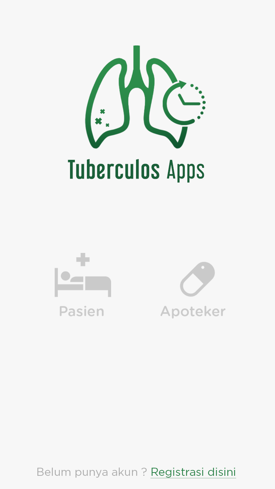
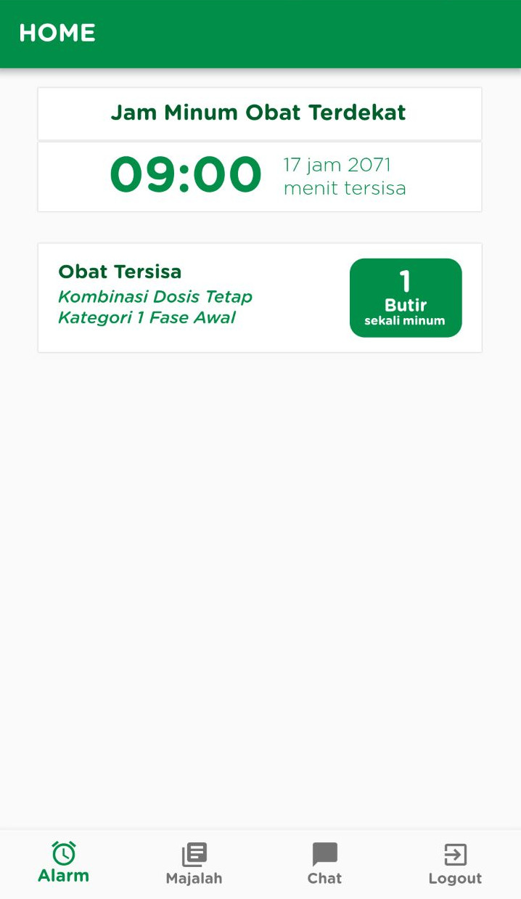
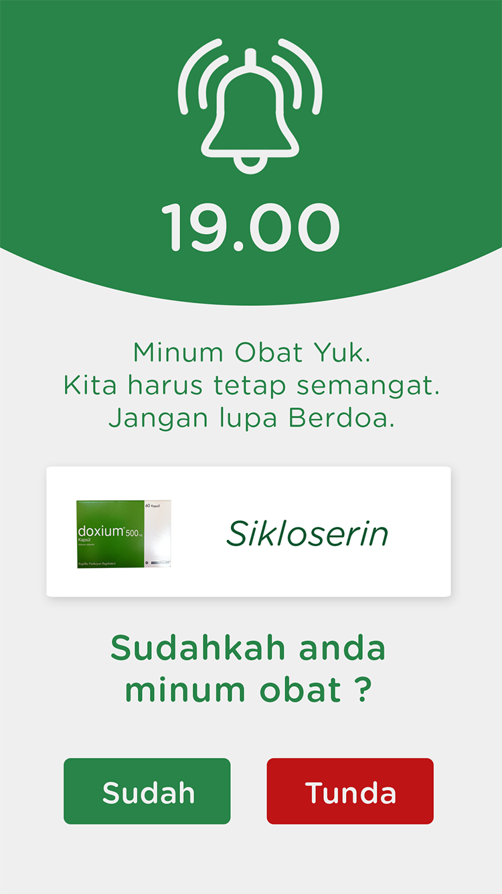
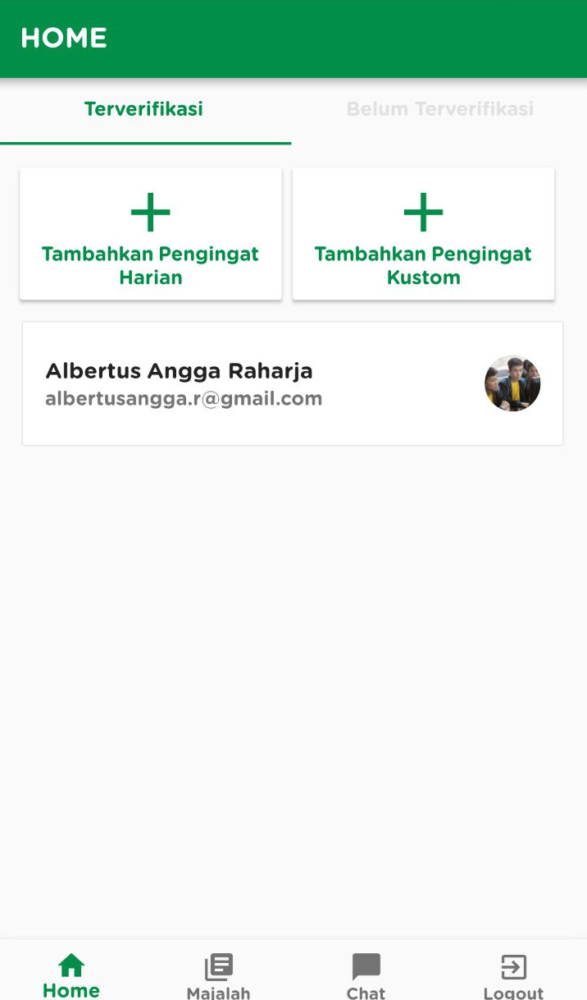
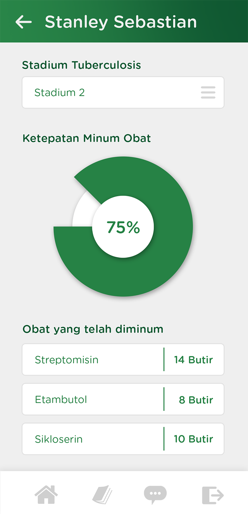

# TuberculosApp
An application for pharmacist to help monitor and remind their patient to take their medicine regularly.

## Screenshots
<div style="display: flex; align-items: flex-start; justify-content: flex-start;">
  
  
  
  
  
  
  
</div>

## Features
- Login & Register as Pharmacist / Patient
- [Patient] Dashboard Screen to see incoming medicine intake
- [Patient] Alarm Screen to remind Patient to take their medicine
- [Shared] Real time consultation via chat between Pharmacist and Patient
- [Pharmacist] Dashboard to add daily/custom medicine reminder for patient
- [Pharmacist] Add Reminder Screen
- [Pharmacist] Patient Detail screen for monitoring their accuracy statistic

## Tech Stack
- Flutter
- Dart
- Firebase

## Installation
- Install [Flutter](https://flutter.io/get-started/install/)
- Install [Android Studio](https://developer.android.com/studio/)
- Clone this repository (```git clone https://github.com/adalberht/tuberculos-app```)
- Open project in Android Studio
- Install Flutter dependencies (Tools > Flutter > Flutter Packages Get)
- Configure your Virtual Device
- Run

## Demo App (APK)
If you are interested on trying out this application, you can download it at [Google Drive](https://drive.google.com/file/d/1Dc3l4nNZLmV01qjsIbGGVoQkSfMUdPjB/view?usp=sharing)
